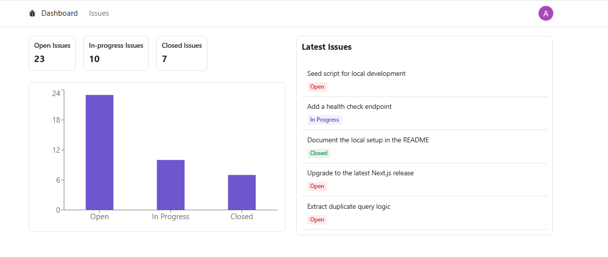
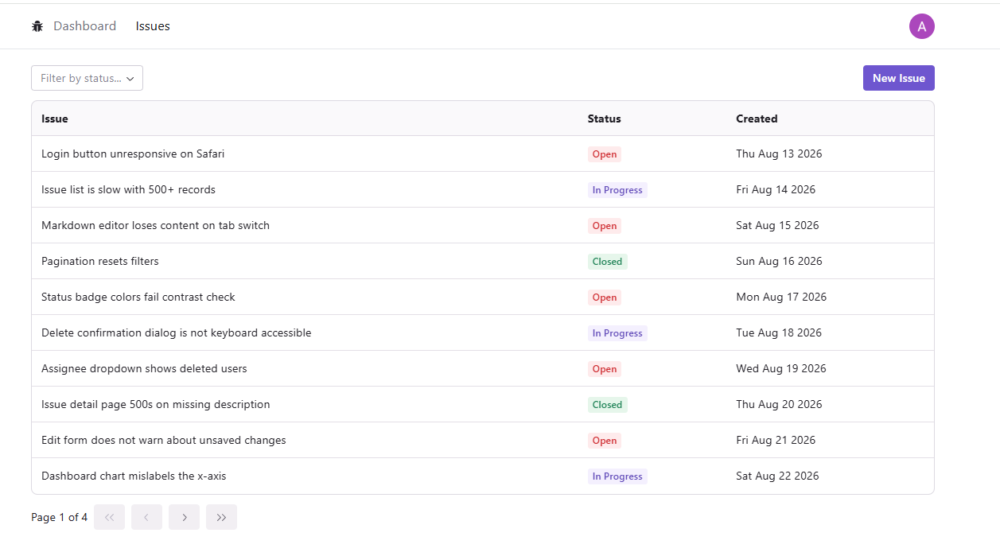
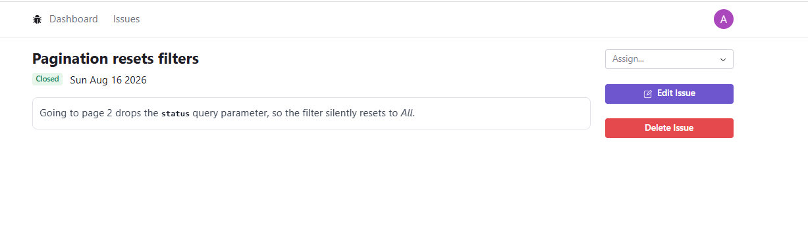

# Issue Tracker

A full-stack issue tracker built with Next.js 13 (App Router), TypeScript, Prisma and MySQL. Issues can be created, assigned, filtered, sorted and paginated, and a dashboard summarises the current state of the project.

## Features

- **Issue management** — create, edit and delete issues with markdown descriptions
- **Assignment** — assign an issue to any authenticated user
- **Filtering and sorting** — filter by status, sort by any column, with the state kept in the URL
- **Pagination** — server-side pagination that survives filter and sort changes
- **Dashboard** — issue counts by status, a bar chart and the five most recent issues
- **Authentication** — Google sign-in via NextAuth, with sessions stored as JWTs
- **Validation** — the same Zod schemas guard both the client form and the API routes
- **Loading states** — skeletons on every data-driven page

## Screenshots

### Dashboard

Issue counts by status, a bar chart and the five most recent issues.



### Issue list

Filtering by status, sortable columns and pagination.



### Issue details

The markdown description, the assignee select and the edit and delete actions.



## Tech stack

| Area | Tools |
| --- | --- |
| Framework | Next.js 13 (App Router), React 18, TypeScript |
| Styling | Tailwind CSS, Radix UI Themes |
| Data | Prisma ORM, MySQL (TiDB Cloud) |
| Auth | NextAuth with the Google provider |
| Forms | React Hook Form, Zod |
| Client state | TanStack Query |
| Charts | Recharts |

## Getting started

### Prerequisites

- Node.js 20 (the version is pinned in `.nvmrc`; newer releases are not supported by Next 13)
- A MySQL database — locally, or hosted on TiDB Cloud / PlanetScale
- A Google OAuth client for sign-in

### Installation

```bash
git clone https://github.com/alinahusak/next-js-issue-tracker.git
cd next-js-issue-tracker
npm install
```

### Environment variables

Copy `.env.example` to `.env` and fill in the values:

```bash
cp .env.example .env
```

| Variable | Description |
| --- | --- |
| `DATABASE_URL` | MySQL connection string. Hosted providers usually require TLS, e.g. `?sslaccept=strict` |
| `NEXTAUTH_URL` | Base URL of the app — `http://localhost:3000` in development |
| `NEXTAUTH_SECRET` | Secret used to sign session tokens — generate with `openssl rand -base64 32` |
| `GOOGLE_CLIENT_ID` | From Google Cloud Console → Credentials |
| `GOOGLE_CLIENT_SECRET` | From the same OAuth client |

When creating the Google OAuth client, add `http://localhost:3000` as an authorised JavaScript origin and `http://localhost:3000/api/auth/callback/google` as an authorised redirect URI.

### Database

Apply the migrations and, optionally, load 40 sample issues:

```bash
npx prisma migrate dev
npx prisma db seed
```

Prisma Studio gives a UI for inspecting the data:

```bash
npx prisma studio
```

### Running the app

```bash
npm run dev
```

The app is served at [http://localhost:3000](http://localhost:3000).

## Scripts

| Command | Description |
| --- | --- |
| `npm run dev` | Start the development server |
| `npm run build` | Generate the Prisma client and build for production |
| `npm start` | Serve the production build |
| `npm run lint` | Run ESLint |
| `npx prisma db seed` | Populate the database with sample issues |

## Project structure

```
app/
├── api/
│   ├── auth/[...nextauth]/   NextAuth route handler
│   ├── issues/               Issue CRUD endpoints
│   └── users/                User list for the assignee select
├── components/               Shared UI (badges, pagination, skeletons)
├── issues/
│   ├── _components/          Issue form and its skeleton
│   ├── [id]/                 Issue detail page
│   ├── edit/[id]/            Edit page
│   ├── list/                 List with filtering, sorting and pagination
│   └── new/                  Create page
├── auth/                     Session provider
└── page.tsx                  Dashboard
prisma/
├── schema.prisma             Data model
├── migrations/               Migration history
└── seed.ts                   Sample data
```

## API

| Method | Endpoint | Description |
| --- | --- | --- |
| `GET` | `/api/issues` | List issues |
| `POST` | `/api/issues` | Create an issue |
| `PATCH` | `/api/issues/:id` | Update an issue or its assignee |
| `DELETE` | `/api/issues/:id` | Delete an issue |
| `GET` | `/api/users` | List users available as assignees |

Request bodies are validated with the Zod schemas in `app/validationSchemas.ts`; invalid payloads return `400` with the validation errors.

## Data model

`Issue` holds the title, markdown description, status (`OPEN`, `IN_PROGRESS`, `CLOSED`), timestamps and an optional assignee. `User`, `Account`, `Session` and `VerificationToken` back the NextAuth Prisma adapter.

## Deployment

The app is deployed on Vercel.

1. Push the repository to GitHub and import it into Vercel.
2. Add `DATABASE_URL`, `NEXTAUTH_URL` (the production URL), `NEXTAUTH_SECRET`, `GOOGLE_CLIENT_ID` and `GOOGLE_CLIENT_SECRET` under Settings → Environment Variables.
3. Add the production origin and `https://<your-domain>/api/auth/callback/google` to the Google OAuth client.
4. Run `npx prisma migrate deploy` against the production database.

`npm run build` runs `prisma generate` first, so the client is regenerated on every deployment.
